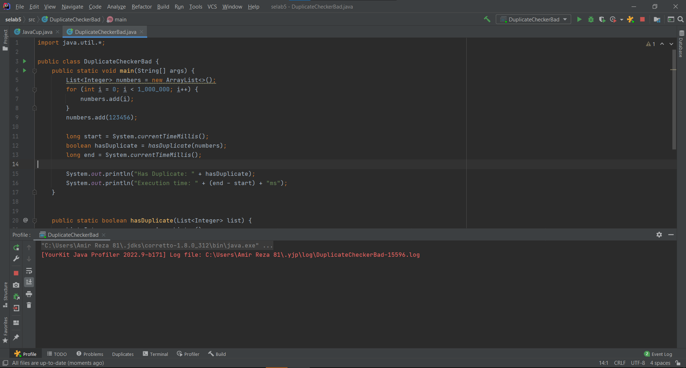
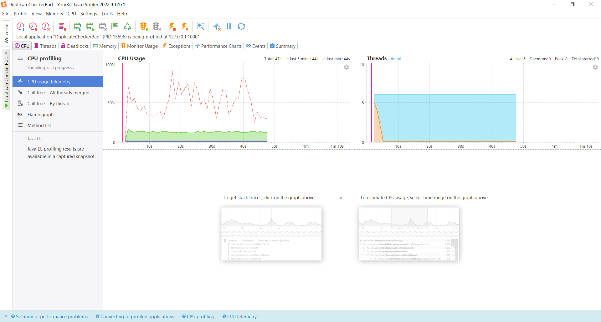
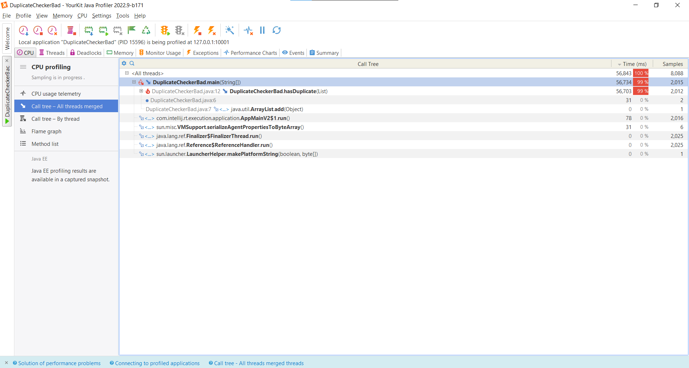
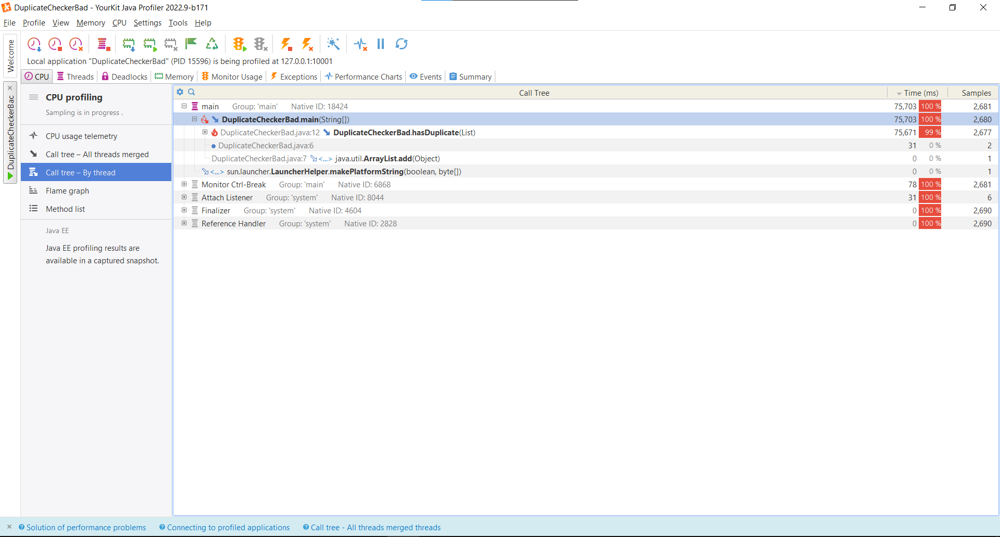
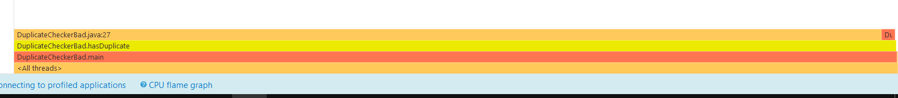
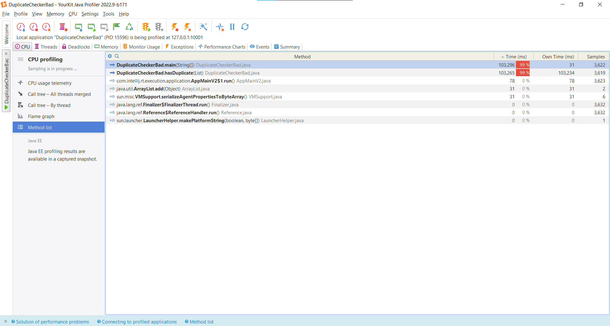
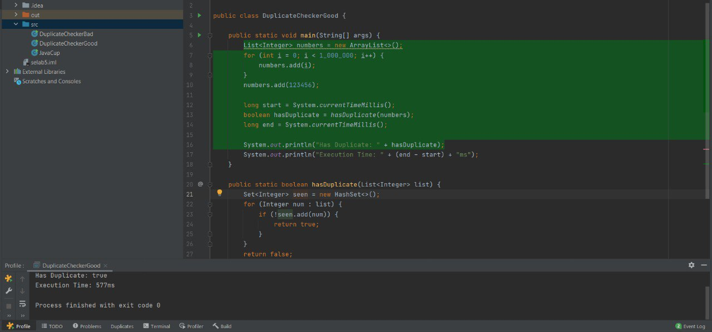
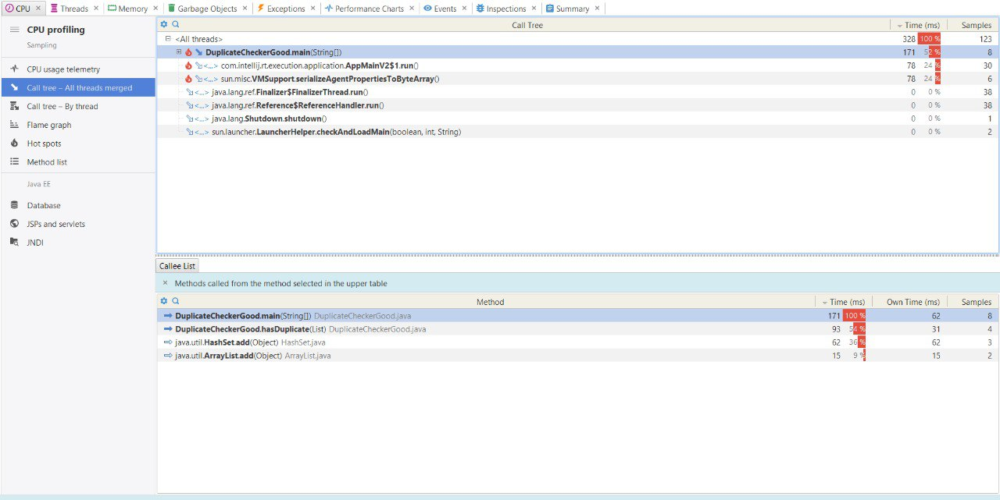
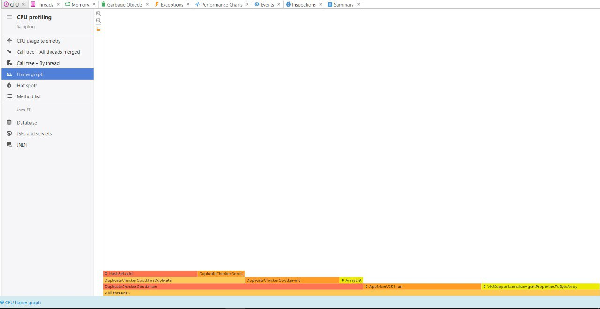
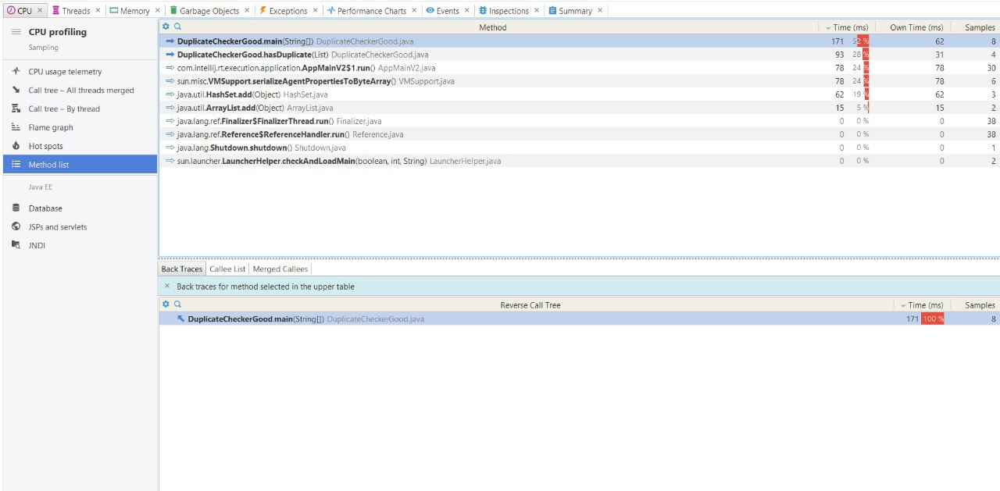

# Software-Engineering-Lab-Exp5

## بخش اول - پروفایلینگ JavaCup
در ابتدا کد JavaCup را با استفاده از YourKit ران کرده و Profiling را انجام می دهیم. ابتدا مشاهده می شود که برنامه تا آخر اجرا نشده است و ارور OutOfMemory داده است:


سپس آنالیز را با استفاده از YourKit انجام می دهیم. با توجه به داده های گزارش شده می توان فهمید که تابع temp بیشترین میزان مصرف را دارد و باعث ارور دادن برنامه می شود:


در این تابع، یک ArrayList به نام a ایجاد می‌شود که در هر بار اجرای حلقه‌های تو در تو، برای هر ترکیب از i و j یک مقدار جدید به آن افزوده می‌شود. این فرآیند باعث ایجاد تعداد زیادی شیء و افزایش غیرضروری در مصرف حافظه و زمان پردازش می‌گردد. زیرا ArrayList به صورت پویا عمل می‌کند و با هر بار افزودن عنصر جدید، ممکن است نیاز به تخصیص حافظه‌ی تازه‌ای داشته باشد. زمانی که تعداد تکرارها زیاد باشد، این تخصیص‌های مکرر حافظه و گسترش پیاپی ظرفیت لیست، منجر به مصرف زیاد منابع و کاهش کارایی کلی برنامه می‌شود. بنابراین با این متد پیش رفتن باعث پر شدن حافظه و ارور OutOfMemory می شود:


برای بهینه‌سازی مصرف منابع، به جای استفاده از ArrayList که به‌صورت پویا حافظه را مدیریت می‌کند، می‌توان از یک آرایه‌ی دوبعدی با اندازه‌ی مشخص استفاده کرد. این روش باعث می‌شود حافظه از ابتدا به‌طور کامل تخصیص داده شود و نیازی به افزایش تدریجی ظرفیت یا جابجایی داده‌ها در حافظه نباشد. در نسخه بهینه‌شده، یک آرایه‌ی دوبعدی از نوع int با ابعاد ۲۰۰۰۰ در ۱۰۰۰۰ تعریف شده است، که هر مقدار مستقیماً در مکان مناسب خود در آرایه قرار می‌گیرد. با این کار، مدیریت حافظه ساده‌تر و کارآمدتر می‌شود و از سربار ناشی از ساختارهای داینامیک جلوگیری خواهد شد:


حال دوباره عمل Profiling را انجام می دهیم. در ابتدا مشاهده می شود که برنامه تا انتها اجرا شده است:


همچنین با استفاده از YourKit می توان مشاهده کرد مقدار استفاده از منابع نیز بسیار کاهش یافته است:


---

### بخش دوم

در این بخش کدی را پیاده‌سازی کرده‌ایم که لیستی از یک میلیون عدد تولید می‌کند و بررسی می‌کند که آیا عدد تکراری وجود دارد یا نه.

## چرا این نسخه ناکارآمد است

در کد زیر، از ArrayList برای بررسی تکراری بودن استفاده شده:

```java
List<Integer> seen = new ArrayList<>();
for (Integer num : list) {
    if (seen.contains(num)) {
        return true;
    }
    seen.add(num);
}
```

- متد `contains()` در ArrayList زمان اجرای O(n) دارد.
- این حلقه برای هر عدد اجرا می‌شود، بنابراین کل الگوریتم دارای پیچیدگی O(n^2) است.
- در لیست‌های بزرگ بسیار کند و پرمصرف است.

حال به بررسی Profiling بر روی آن می‌پردازیم. در ابتدا مشاهده می‌کنیم کد به دلیل هزینه محاسباتی بالا خروجی‌ای تولید نمی‌کند .



سپس به سراغ yourkit رفته و دقیقا نتایج مورد انتظار را مشاهده می‌نماییم:







### بهبود الگوریتم
برای بهبود این کد میتوان از مکانیزم hashing استفاده کرد تا پیچیدگی زمانی کد کاهش پیدا کند. در واقع ما اعداد را به ترتیب به یک hashset اضافه می‌کنیم و قبل از اضافه کردن هر عضو،
چک می‌کنیم که آیا در hashset ما وجود دارد یا خیر.
در واقع بررسی موجود بودن یک عضو در hashset،
دارای پیچیدگی O(1)
است، پس یعنی به طور کلی پیچیدگی کد ما O(n)
خواهد که به مراتب نسبت به حالت اول بهینه تر است.
در ادامه کد مربوط به قسمت hash را می‌بینید.
```java
Set<Integer> seen = new HashSet<>();
for (Integer num : list) {
    if (!seen.add(num)) {
        return true;
    }
}
```
همچنین با استفاده از yourkit کدمان را بررسی می‌کنیم
و مشاهده می‌کنیم که بهبود مورد انتظار حاصل شده است.






